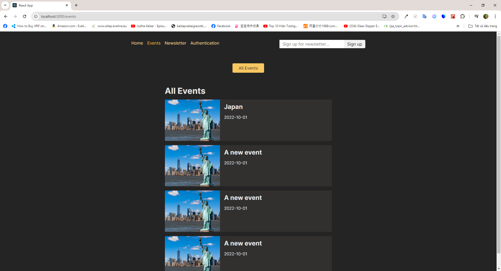
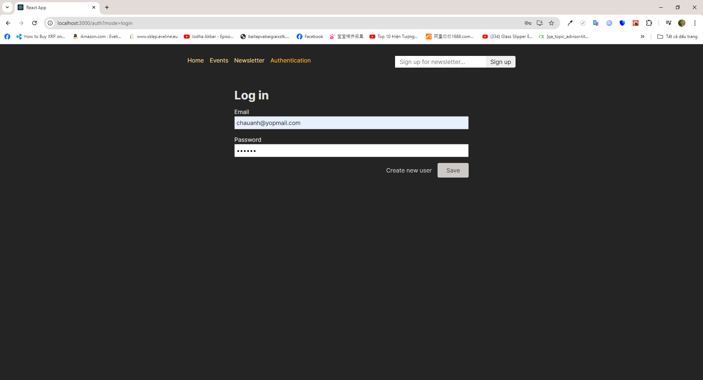

# Introdution

- I ultilize the website in the section Router here. The only difference is that this website now is added with a simple authentication mechanism (with JWT) alowing users to login/signup

# Installation

## Requirements

- NodeJS v18 is required beforehand

## Steps

- Make sure to run <code>npm i</code> and then <code>node app.js</code>/<code>npm start</code>/<code>npm run dev</code>/ <code>nodemon app.js</code> (if you use nodemon) in the backend server beforehand
- Run <code>npm i</code> in the front-end server to install all dependencies
- Run <code>npm run dev</code> or <code>npm start</code> to start the development process

# Previews

1.  Snapshot 1
    

2.  Snapshot 2
    
