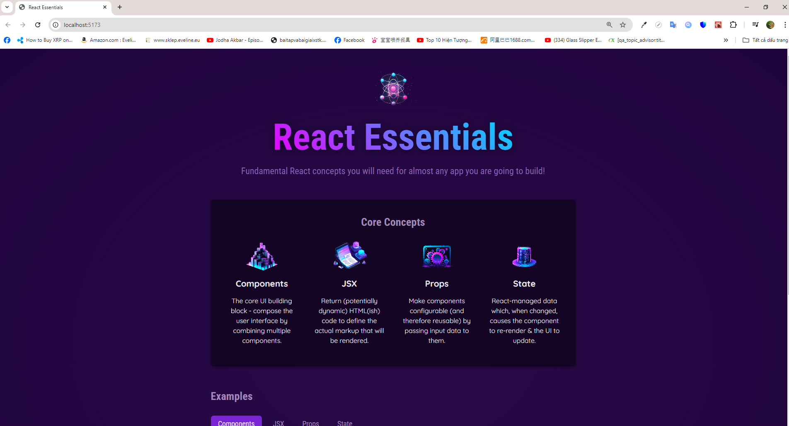
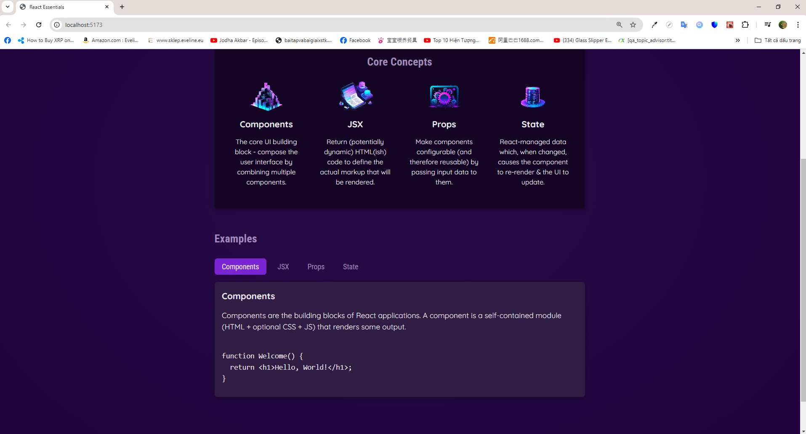

# Introdution

- In this React Core Concept mini practice project:

* Render 2 components: CoreConcepts and Examples that are nested within the App component
* The CoreConcept component should be rendered as the Snapshot 1 shown below
* The Example component should be rendered as the Snapshot 2 shown below. The Example component include the Header In the Example component, there is a Tabs component that includes different Tab components. When the user clicks on a specific Tab, the handler will be triggered and rendered the corresponding content below
* The mock data can be found in data.js file

# Installation

## Requirements

- NodeJS v18 is required beforehand

## Steps

- Run <code>npm i</code> to install all dependencies
- Run <code>npm run dev</code> or <code>npm start</code> to start the development process

# Previews

1.  Snapshot 1
    

2.  Snapshot 2
    
