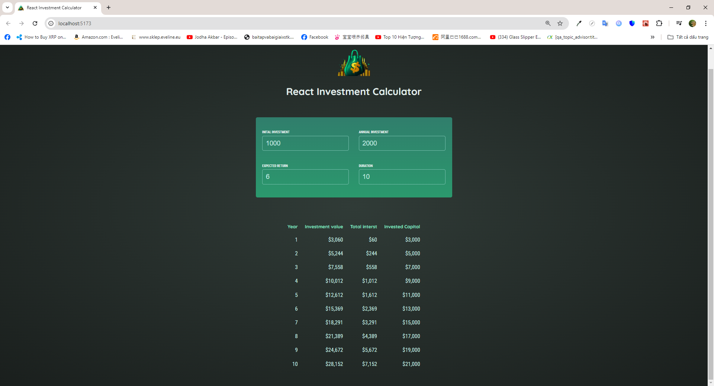

# Introdution

- In this React Core Concept mini practice project, I create a mini caculator that caculates the expected return one receives after a duration of time. I apply lifting-up-state technique to make sure that the user input changes will be lifted to the nearest parent component with Result component, and as a result, will also afect Result component whenever they change value.

# Installation

## Requirements

- NodeJS v18 is required beforehand

## Steps

- Run <code>npm i</code> to install all dependencies
- Run <code>npm run dev</code> or <code>npm start</code> to start the development process

# Previews

1.  Snapshot 1
    
