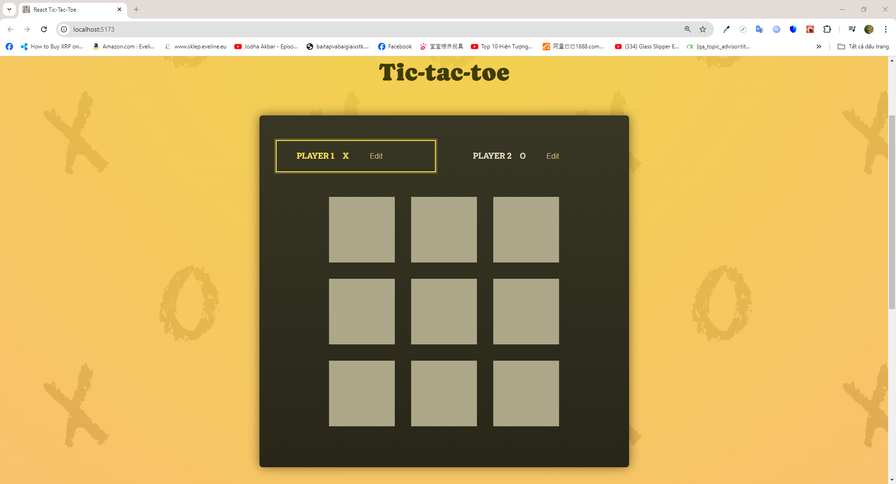
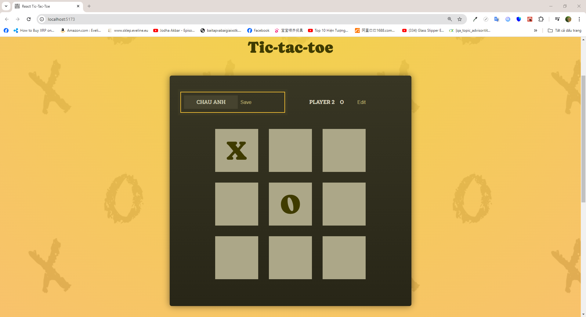
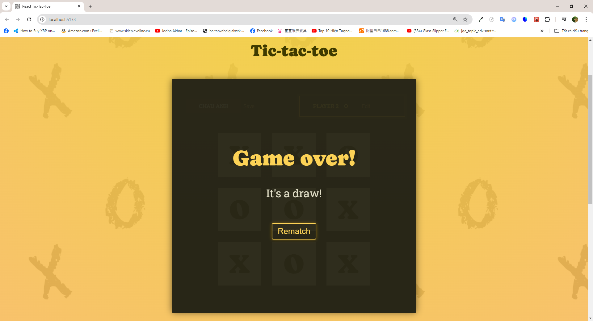
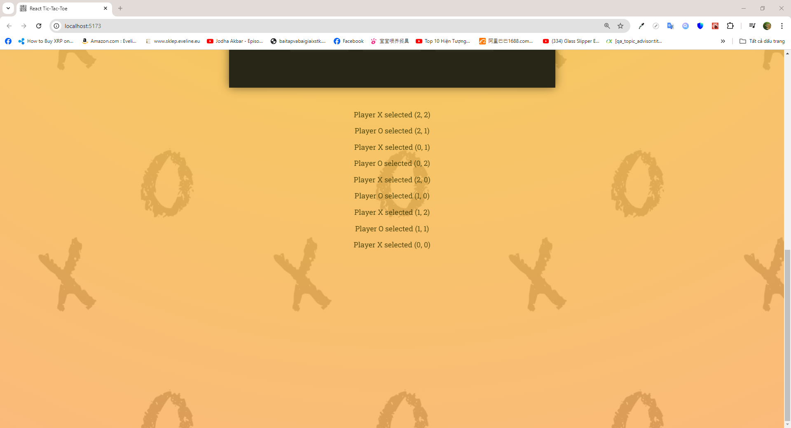
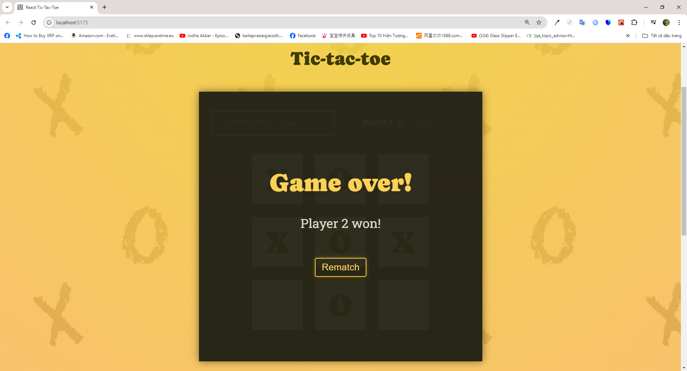

# Introdution

- I create a Tic tac toe game (with mock logic for wining combinations). Besides practice ReactJS Core Concepts, I also apply lifting-up-state technique to allow shared state between components.
- In this project, the users can:
  👉 User can change their displaying name
  👉 Play tic tac toe with simple 3x3 matrix
  👉 Track users turns as in Snapshot 4
  👉 Display a basic notification panel when the game is drawn or there is a winner (as shown in Snapshot 5)

# Installation

## Requirements

- NodeJS v18 is required beforehand

## Steps

- Run <code>npm i</code> to install all dependencies
- Run <code>npm run dev</code> or <code>npm start</code> to start the development process

# Previews

1.  Snapshot 1
    

2.  Snapshot 2
    

3.  Snapshot 3
    

4.  Snapshot 4
    

5.  Snapshot 5
    
