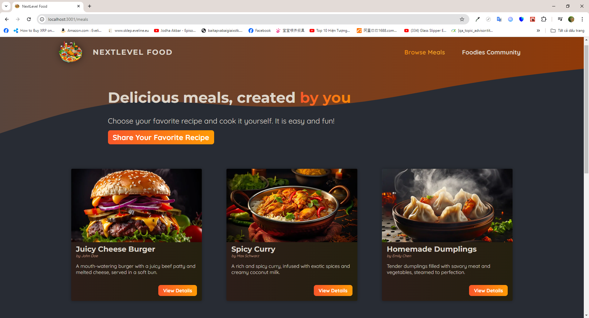
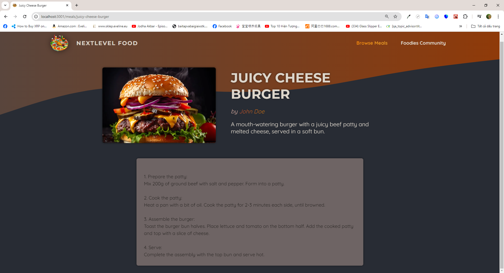
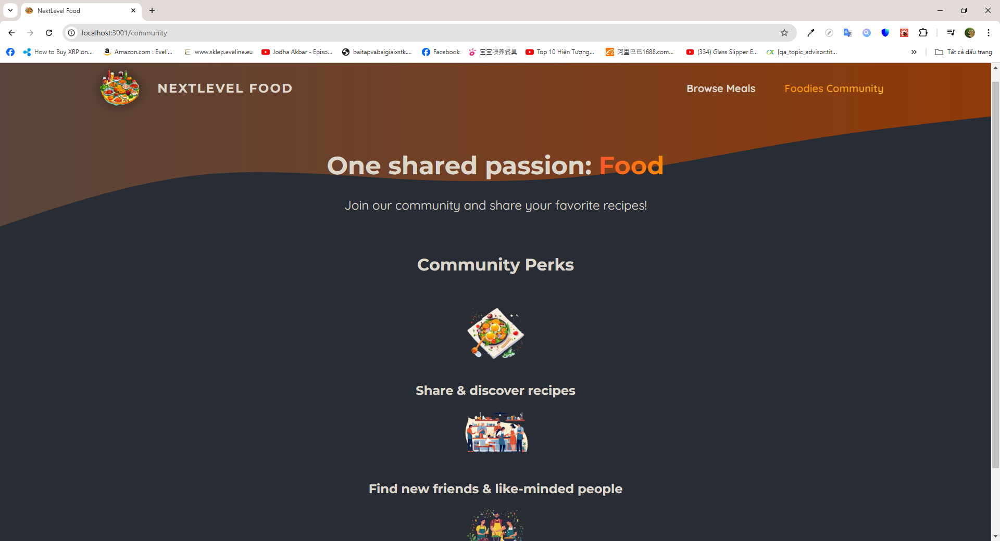
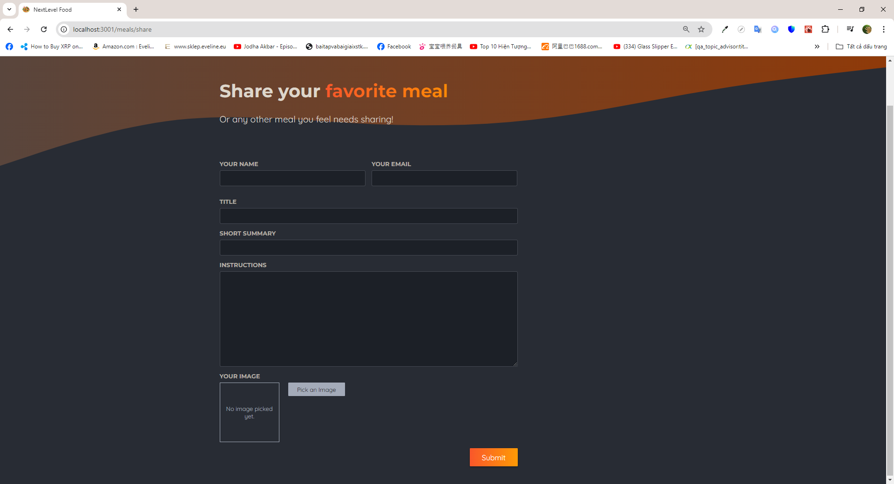

# Introdution

- I create a simple website rendering meals fetched from a sqlite database
- Users can see meals and share their menu with the community

# Installation

## Requirements

- NodeJS v18 is required beforehand

## Steps

- Run <code>npm i</code> in the front-end server to install all dependencies
- Run <code>npm run dev</code> or <code>npm start</code> to start the development process

# Previews

1.  Snapshot 1
    

2.  Snapshot 2
    

3.  Snapshot 4
    

4.  Snapshot 5
    
