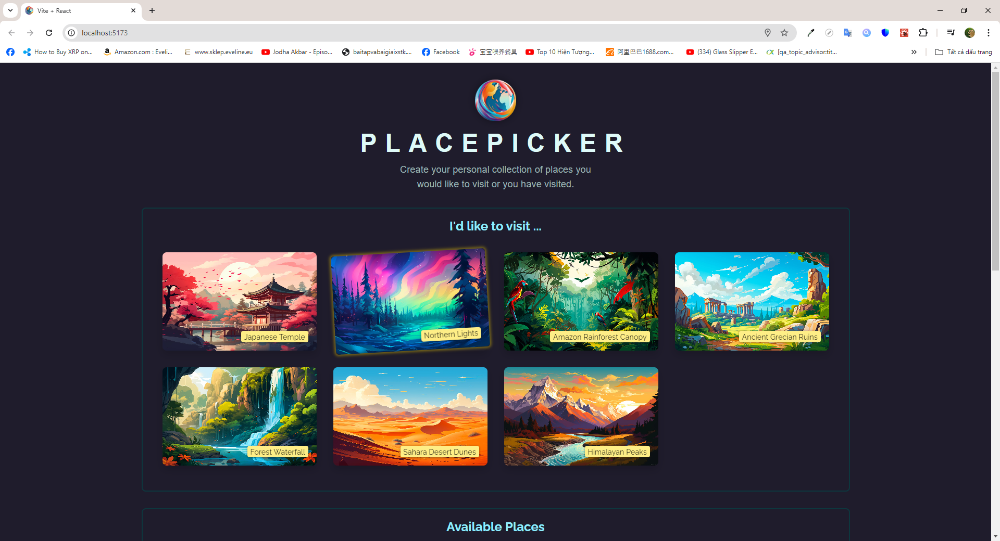
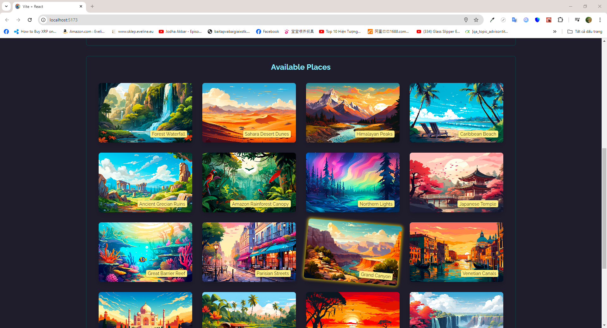
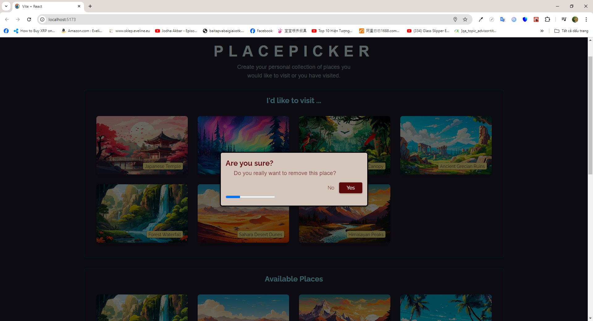

# Introdution

- In this mini project, I create a simple back-end that offers API for interacting with data
- The front-end websire render places fetched from the back-end using custom hooks and useEffect to handle side-effects
- Users can add and update places to want-to-visit section

# Installation

## Requirements

- NodeJS v18 is required beforehand

## Steps

- Make sure to run <code>npm i</code> and then <code>node app.js</code>/ <code>nodemon app.js</code>(if you use nodemon)/ <code>npm start</code>/ <code>npm run dev</code> in the backend server beforehand
- Run <code>npm i</code> in the front-end server to install all dependencies
- Run <code>npm run dev</code> or <code>npm start</code> to start the development process

# Previews

1.  Snapshot 1
    

2.  Snapshot 2
    

3.  Snapshot 3
    
