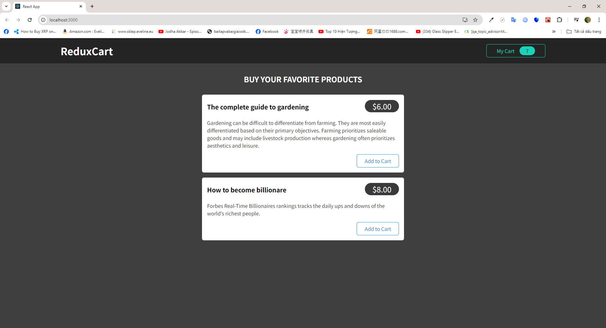
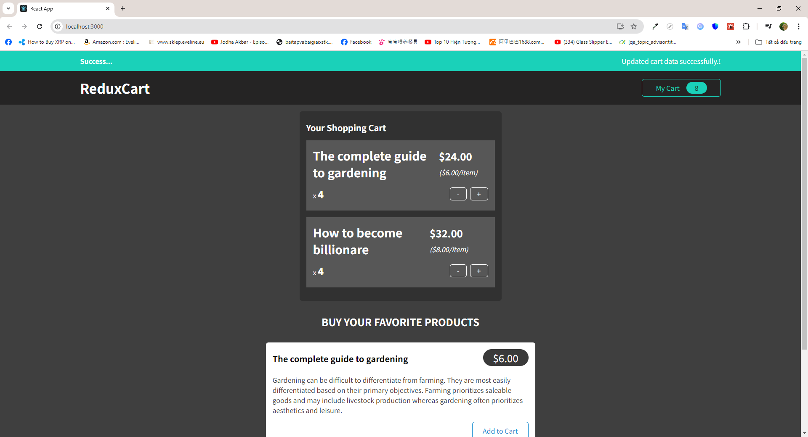

# Introdution

- In this Redux mini practice project, a basic website with data from a simple Firebase server is created to practice the concept of Redux
- Basically, a redux store is created to manage uiSliceReducer (manage shared tasks and state related to UI) and cartSliceReducer (manage shared tasks and state related to cart)
- I also use the concept of thunk (a function that is called after another function) to fetch from and send data to the firebase storage

# Installation

## Requirements

- NodeJS v18 is required beforehand

## Steps

- Run <code>npm i</code> to install all dependencies
- Run <code>npm run dev</code> or <code>npm start</code> to start the development process

# Previews

1.  Snapshot 1
    

2.  Snapshot 2
    
