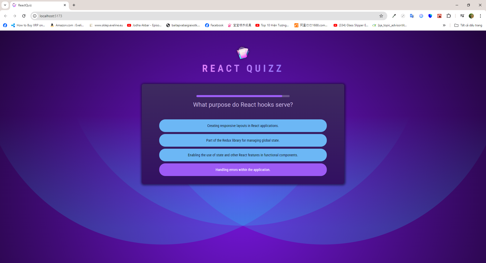
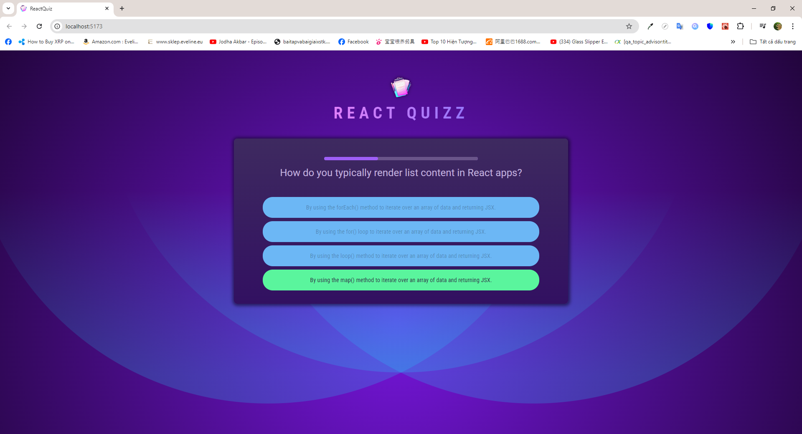
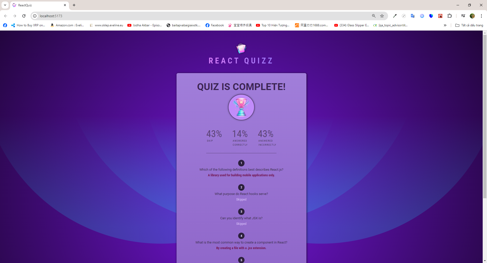

# Introdution

- In this mini practice project, I create a simple Quizzapp
- Mock data can be found in question.js

# Installation

## Requirements

- NodeJS v18 is required beforehand

## Steps

- Run <code>npm i</code> to install all dependencies
- Run <code>npm run dev</code> or <code>npm start</code> to start the development process

# Previews

1.  Snapshot 1
    

2.  Snapshot 2
    

3.  Snapshot 3
    
